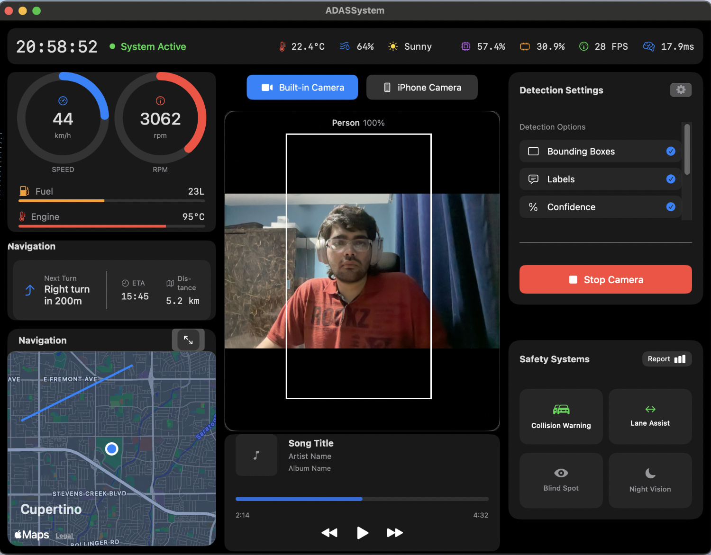

# ADASSystem

## Overview

ADASSystem is a macOS application that provides advanced driver assistance system functionality through computer vision and real-time object detection. Built with SwiftUI and leveraging Core ML, this application can detect vehicles, pedestrians, and other road objects to enhance driving safety.

## Features

- **Real-time Object Detection**: Identifies and classifies objects such as cars, trucks, buses, and pedestrians
- **Dual-Camera Support**: Seamlessly switch between built-in Mac camera and iPhone camera (via Continuity Camera)
- **Vehicle Metrics Display**: Shows current speed, RPM, engine temperature and fuel level
- **Navigation Integration**: Provides turn-by-turn directions with Apple Maps
- **Safety Systems**: Includes collision warning, lane assist, blind spot monitoring, and night vision features
- **Media Controls**: Integrated music playback controls

## System Requirements

- macOS 15.1 or later
- Mac with built-in camera or external webcam
- iPhone with iOS 16 or later (for Continuity Camera functionality)
- Sufficient processing power for real-time computer vision

## Technical Architecture

ADASSystem is built using:

- **SwiftUI**: For the modern, declarative user interface
- **AVFoundation**: For camera input handling
- **Core ML & Vision**: For object detection and computer vision processing
- **MapKit**: For mapping and navigation features

### Key Components

- **CameraManager**: Handles camera selection, configuration, and frame capture
- **ObjectDetector**: Processes video frames through the ML model for detection
- **CameraView**: Renders the camera feed with detection overlays
- **ContentView**: Main UI controller that integrates all components

## ML Model

The application uses a custom-trained Core ML model (`ADAS_Safety_System1.mlmodelc`) for object detection, which should be added to the project's resources. This model is trained to recognize:

- Cars
- Trucks
- Buses
- Pedestrians

## Installation

1. Clone this repository
2. Open the project in Xcode 16.1 or later
3. Add your trained Core ML model to the project resources
4. Build and run the application

## Usage

1. Launch the application
2. Select your preferred camera source (Built-in or iPhone)
3. Click "Start Camera" to begin detection
4. The application will display bounding boxes and confidence scores for detected objects
5. Use the safety system indicators to monitor potential hazards

## Development

### Project Structure

- **ADASSystemApp.swift**: Entry point for the application
- **ContentView.swift**: Main view controller
- **CameraManager.swift**: Camera input and processing
- **ObjectDetector.swift**: ML model integration and detection processing
- **CameraView.swift**: Camera preview rendering

### Building and Testing

The project includes unit tests (`ADASSystemTests`) and UI tests (`ADASSystemUITests`) to ensure functionality.

## Privacy and Permissions

The application requires the following permissions:

- Camera access for object detection
- Microphone access for video recording (if enabled)

These permissions are requested via the `Info.plist` file and are essential for the app's functionality.

## Future Enhancements

- Lane detection and departure warning
- Distance estimation between objects
- Enhanced night vision capabilities
- Speed limit recognition
- Driver alertness monitoring

## Credits

Created by Yash Shindey (2024)

---

For questions or support, please open an issue on this repository or contact.
